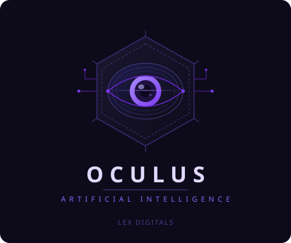

<div align="center">



<br><br>

**A custom-built AI operating system for running a digital agency.**
Memory that persists. Actions that execute. Code that runs. Guardrails that don't get in the way.

<br>


<br>

### 🚀 [Try it live → oculusai.lexdigitals.co.za](https://oculusai.lexdigitals.co.za/)

<br>

> Built by **Alex** · [Lex Digitals](https://lexdigitals.co.za)

</div>

---

## Contents

- [What is Oculus?](#what-is-oculus)
- [Why Oculus Exists](#why-oculus-exists)
- [How Oculus Compares](#how-oculus-compares)
- [Core Capabilities](#core-capabilities)
- [Recent Upgrades (26 June 2026)](#recent-upgrades-26-june-2026)
- [Architecture](#architecture)
- [Deployment](#deployment)
- [Project Structure](#project-structure)
- [Design Philosophy](#design-philosophy)
- [User Guide](#user-guide)

---

## What is Oculus?

Oculus is an **AI Knowledge Workspace & Actions Engine**, purpose-built for running a digital agency. Most AI chat tools forget context between sessions, hand back advice instead of finished work, or refuse entire categories of client copy. Oculus is built differently — it layers an LLM directly over isolated client workspaces, persistent memory, live document intelligence, an in-chat code sandbox, and an actions engine that actually executes: compiling proposals, drafting emails, and scheduling tasks instead of just describing them.

---

## Why Oculus Exists

| Problem | Oculus's Fix |
|---|---|
| **Context-switching tax** — chat logs, attachments, and sandbox files bleed between clients. | **Isolated Client Workspaces.** Every client gets its own chat history, files, and sandbox folder, while long-term memory stays shared globally. |
| **The "forgetting" problem** — LLMs lose your styling rules, client facts, and deadlines once the context window resets. | **Oculus Brain.** A background pipeline extracts and consolidates facts into persistent memory, auto-injected into every request. |
| **Advice instead of action** — most chatbots hand you markdown you still have to copy, format, and send yourself. | **AI Actions Engine.** Oculus proposes the task, proposal, or email as an editable card; you confirm, it executes. |
| **Placeholder code** — `// TODO: add logic here` isn't a deliverable. | **Live Code Sandbox.** HTML/CSS/JS/SVG renders in a split-screen preview you can edit, run, and save to the project. |
| **Guardrail blocks on legitimate campaigns** — mainstream tools refuse entire ad categories outright. | **OpenRouter Model Gateway.** Routes through lightly-moderated open models so client copy for those campaigns actually gets written. |

---

## How Oculus Compares

Oculus isn't trying to out-reason GPT-5.5 or Grok — it's solving a different problem: **turning a chat window into a working agency operating system.** Here's how it stacks up against general-purpose assistants and typical AI chat-wrapper SaaS tools:

| Capability | **Oculus AI** | **ChatGPT** (Plus/Team) | **Grok** | Typical AI Wrapper SaaS |
|---|---|---|---|---|
| Persistent cross-session memory | ✅ Full "Brain" — confidence scoring, decay, conflict resolution | ✅ Rolling memory + chat-history reference | ✅ Basic editable memories | ⚠️ Rare — most reset every session |
| Isolated multi-client workspaces | ✅ Native — separate chat, files & sandbox per client; memory stays global | ⚠️ "Projects" group chats/files, no DB or sandbox isolation | ⚠️ "Projects" sidebar, similar limits | ❌ Usually one flat workspace |
| Executes real work, not just text | ✅ Actions Engine compiles `.docx`/`.pdf`, drafts emails, books deadlines via confirm-and-run cards | ⚠️ Tasks & emerging Agent mode; Custom GPT Actions need setup | ⚠️ Early Agent mode can run code / use a sandboxed computer | ❌ Almost always copy-paste output |
| Document RAG with citations | ✅ Hybrid vector + full-text search, RRF ranking, page-level citations | ✅ File Q&A in chat/projects | ✅ File uploads in projects | ⚠️ Inconsistent, often absent |
| Live in-chat code sandbox | ✅ Split-screen HTML/CSS/JS/SVG editor — edit, run, save to project | ⚠️ Python code interpreter; no live HTML/CSS preview pane | ⚠️ Agent mode gets sandboxed compute, still maturing | ❌ Not supported |
| Open / lightly-moderated model routing | ✅ OpenRouter gateway — Nemotron, Llama 3.3, Hermes 3, Dolphin Mistral, etc. | ❌ Fixed GPT models, standard moderation | ⚠️ "Spicy Mode" loosens tone; image/video stay tightly moderated | ⚠️ Depends entirely on the wrapper |
| Data ownership | ✅ Deployed on your own Supabase/Render accounts | ❌ Hosted entirely by OpenAI | ❌ Hosted entirely by xAI | ⚠️ Varies by vendor |
| Built specifically for agency/client work | ✅ Purpose-built | ❌ General-purpose assistant | ❌ General-purpose assistant | ⚠️ A handful of vertical tools exist |
| Pricing | 💰 Pay only for API usage (OpenRouter/Supabase/Tavily credits) — no seat fees | 💳 Per-seat subscription (~$20–$200+/mo) | 💳 Per-seat subscription (SuperGrok/Premium+) | 💳 Usually subscription/seat-based |

> Claude.ai and Gemini land in roughly the same column as ChatGPT — strong general reasoning and project-style organization, but no agency-specific actions engine, workspace isolation, or uncensored model routing. Feature sets for all hosted assistants move quickly; this table reflects general positioning as of mid-2026, not an exhaustive audit.

---

## Core Capabilities

<details>
<summary><strong>🧠 Memory & Intelligence</strong></summary>
<br>

| Capability | What it does |
|---|---|
| **Long-Term Memory** | Stores your profile, clients, preferences, and key facts across sessions. Extraction, consolidation, and conflict resolution run automatically in the background. |
| **Oculus Brain UI** | A sliding drawer with a live view of memory — edit profiles, add facts, manage clients and deadlines in real time. |
| **Deep Self-Reflection** | A hidden 2-pass metacognitive review checks every draft against memory and persona before you see the response. |
| **Conversation History** | Keeps recent turns in full and auto-summarises older ones to stay inside the model's context window. |

</details>

<details>
<summary><strong>🏢 Workspaces & Security</strong></summary>
<br>

| Capability | What it does |
|---|---|
| **Client Workspaces** | Switch between isolated workspaces — separate chat history, sandbox files, and attachments per client, with one shared long-term memory underneath. |
| **Multi-User Auth & Security** | Register, log in, log out — every user's data is isolated in Supabase, with backend ownership checks preventing cross-user leakage. |

</details>

<details>
<summary><strong>⚡ Actions & Code</strong></summary>
<br>

| Capability | What it does |
|---|---|
| **AI Actions Engine** | Generates proposals, exports documents (DOCX/PDF/TXT), drafts emails, schedules tasks, and logs every action. Confirm, cancel, or undo from an inline card. |
| **Interactive Code Sandbox** | HTML/CSS/JS/SVG snippets open in a live split-screen iframe — edit, run, and save directly to your workspace. |

</details>

<details>
<summary><strong>📄 Documents & Search</strong></summary>
<br>

| Capability | What it does |
|---|---|
| **Advanced RAG & Doc Intel** | Ingests, chunks, embeds, and indexes PDFs/DOCX in Supabase. Auto-classifies and summarises documents, with hybrid vector + full-text retrieval and RRF ranking. |
| **Live Web Search** | Pulls real-time information via Tavily automatically whenever a query needs current data. |
| **File Upload & Parsing** | Drag-and-drop plaintext/code files — content is injected into the prompt and cleared after each submit. |

</details>

<details>
<summary><strong>⚙️ Models & Infrastructure</strong></summary>
<br>

| Capability | What it does |
|---|---|
| **Manual Model Selection** | Pin any supported model — Nemotron 3 Super 120B, Llama 3.3 70B, Hermes 3 405B, Dolphin Mistral 24B, and more. |
| **Model Fallback Chain** | If the pinned model is rate-limited or times out, Oculus automatically tries the next one in the chain — no failed requests. |
| **Real-Time Streaming** | Token-by-token streaming so responses appear word-by-word as they generate. |
| **Left Dock Layout** | One vertical nav bar for Model selection, Workspace Settings, Oculus Brain, Style Notes, Action Log, and Generated Documents. |

</details>

---

## Recent Upgrades (June 2026)

<details>
<summary><strong>Click to expand — Memory & Intelligence overhaul, Phases 1–3</strong></summary>
<br>

Oculus's memory system was rebuilt across three phases throughout June 2026:

**1. Confidence Scoring & Quality Control**
- Every memory item now carries a `confidence` score (0–1), `source_type` (`conversation` vs `user_explicit`), `last_reinforced` date, and extraction `reasoning`.
- The Brain UI shows High/Medium/Low confidence badges with hover tooltips explaining each extraction.
- Contradictions trigger a **Resolve Memory Conflict** card — keep the old fact, the new one, or both.
- An automatic decay audit drops confidence by `-0.05` per week of inactivity (floor `0.1`) unless reinforced.

**2. Style & Behavior Notes**
- A background analyzer reads recent conversations (every 10 turns, configurable) to infer tone, formatting, vocabulary, and forbidden styles.
- Notes are categorised as `tone`, `formatting`, `vocabulary`, `client_specific`, or `forbidden`.
- A feedback widget appears every 4 responses ("Did this match your style?"). **Yes** reinforces it; **No** lets you correct it, creating a high-confidence (`0.9`) `user_explicit` rule.
- Prefix any prompt with `"Style preference:"` to write a rule directly to memory.

**3. Context Ranking & Conversation Intelligence**
- Memory is ranked by `(relevance × 0.45) + (confidence × 0.25) + (recency × 0.20) + (importance × 0.10)`, using OpenAI's `text-embedding-3-small` for relevance.
- A sub-millisecond in-memory embedding cache removes API latency on lookup.
- Context injection is capped at a configurable token budget (default `1500`); overflow facts compress into one dense summary, only re-running when facts change.
- Plain-language memory commands work in chat — *"forget everything about Vue"*, *"pin Acme mockup deadline"* — and update the Brain UI instantly.
- Pin anything with 📌 for a permanent importance boost (`importance = 1.0`, `+0.3` score); a developer debug panel shows the full scoring breakdown per request.

</details>

<details>
<summary><strong>Click to expand — Backend Architecture & Quality Fixes (Late June 2026)</strong></summary>
<br>

Oculus's backend was refined and hardened in late June 2026 to support the new memory intelligence features:

**1. Normalized Memory Storage (JSONB Migration)**
- Migrated the monolithic `oculus_memory` JSONB blob into a structured, indexed relational table (`oculus_memory_items`).
- Provides safe concurrent writes (eliminating race conditions) and allows fine-grained updates without locking the entire user profile.

**2. Memory Quality & Caps**
- Regex-extracted facts (name, role, company) now default to 0.55 confidence instead of 1.0, preventing accidental overrides of user-set facts.
- Category limits raised significantly (e.g., 50 clients, 40 topics).
- Switched from pure FIFO truncation to score-based eviction (`confidence × 0.5 + recency × 0.5`).
- Consolidation safety checks added: rejects LLM merges that lose >20% of items to prevent silent data loss.

**3. 2-Pass Self-Reflection**
- Added heuristic filtering to skip heavy critique passes on trivial messages (<80 chars) unless they involve actions or financial figures.
- The critique prompt now receives the exact same RAG, Web, and File context as the draft to eliminate hallucinations.
- Introduced `reflection_model` in workspace settings, allowing the use of a faster model for the critique pass.

**4. Conversation History Digest**
- Background summarisation now uses an LLM to generate a structured bullet-point digest (topics, decisions, facts) instead of a raw text slice.
- Cleanly caps at 600 characters along sentence boundaries (`.`, `!`, `?`).

**5. Backend Refactoring & Caching**
- Removed redundant Supabase fetches from the `ask()` and `build_prompt()` chain, saving 2 network roundtrips per message.
- Replaced the unbounded embedding dictionary with a memory-safe `collections.OrderedDict` LRU cache capped at 2,000 entries.
- Fixed a cross-user state leak in the developer debug panel.

</details>

---

## Architecture

```
Oculus AI
│
├── Flask              → Web server, routing, session auth, client workspaces
├── Actions Engine     → Intent classifier (Llama 3.3), execution wrapper, audit logs
├── RAG Pipeline       → PDF/DOCX extractors, semantic chunker, vector embeddings (OpenRouter)
├── OpenRouter API     → AI model gateway (OpenAI-compatible)
│   ├── Nemotron 3 Super 120B   → Primary — fast, cheap, unmoderated
│   ├── Llama 3.3 70B           → Fallback 1 — balanced, reliable
│   ├── Hermes 3 405B           → Fallback 2 — powerful, unmoderated
│   ├── Dolphin Mistral 24B     → Fallback 3 / switcher — uncensored
│   └── Free fallbacks          → Nemotron 3, Llama 3.3, Hermes 3 405B
├── Supabase Auth      → Registration, login, logout
├── Supabase DB        → Memory, workspace config, chat history, action log, RAG vectors
├── Tavily Search      → Live web search injected into prompt context
└── Prompt Engine      → Injects memory, workspace context, search results, date/time
```

---

## Deployment

### Requirements
- Python 3.10+
- A [Supabase](https://supabase.com) account
- A [Render](https://render.com) account (or any Python host)
- An [OpenRouter](https://openrouter.ai) account (free tier works; credits recommended)
- A [Tavily](https://tavily.com) account (free tier available)

### Install dependencies

```bash
pip install flask openai supabase tavily-python requests python-docx pypdf docx2pdf reportlab
```

### Environment variables

Set these in your environment (or a local `.env` file):

```env
SUPABASE_URL=your_supabase_project_url
SUPABASE_KEY=your_supabase_secret_key
SECRET_KEY=your_flask_session_secret
TAVILY_API_KEY=your_tavily_api_key
OPENROUTER_API_KEY=your_openrouter_api_key

# Optional SMTP settings for email delivery
ENABLE_SMTP_DELIVERY=false
SMTP_HOST=smtp.gmail.com
SMTP_PORT=587
SMTP_USER=your_email@gmail.com
SMTP_PASSWORD=your_app_password
```

### Database setup

<details>
<summary><strong>Click to expand — full Supabase SQL setup script</strong></summary>
<br>

Run this in your Supabase SQL editor:

```sql
-- Enable vector extension
CREATE EXTENSION IF NOT EXISTS vector;

-- Per-user memory (shared globally across workspaces)
CREATE TABLE oculus_memory (
  user_id UUID PRIMARY KEY,
  memory  JSONB DEFAULT '{}'
);

-- Per-workspace chat history and summaries (workspace-isolated)
-- Note: 'user_id' column stores the workspace_id for isolated context targeting
CREATE TABLE oculus_chat (
  user_id  UUID PRIMARY KEY,
  messages JSONB DEFAULT '[]',
  summary  TEXT  DEFAULT ''
);

-- Workspace lifecycle tracking
CREATE TABLE oculus_workspaces (
  id UUID PRIMARY KEY DEFAULT gen_random_uuid(),
  user_id UUID NOT NULL,
  name TEXT NOT NULL,
  created_at TIMESTAMP WITH TIME ZONE DEFAULT timezone('utc'::text, now())
);

CREATE INDEX idx_oculus_workspaces_user_id ON oculus_workspaces(user_id);

-- Action log history & audit trail
CREATE TABLE oculus_actions (
  id UUID PRIMARY KEY DEFAULT gen_random_uuid(),
  user_id UUID NOT NULL,
  workspace_id UUID NOT NULL,
  action_type TEXT NOT NULL,
  arguments JSONB NOT NULL,
  status TEXT NOT NULL, -- 'pending', 'executed', 'cancelled', 'undone'
  outcome TEXT,
  created_at TIMESTAMP WITH TIME ZONE DEFAULT timezone('utc'::text, now()),
  executed_at TIMESTAMP WITH TIME ZONE
);

CREATE INDEX idx_oculus_actions_user_id ON oculus_actions(user_id);
CREATE INDEX idx_oculus_actions_workspace_id ON oculus_actions(workspace_id);

-- Document Metadata Table (Phase 2 & 3 RAG)
CREATE TABLE oculus_documents (
  id UUID PRIMARY KEY DEFAULT gen_random_uuid(),
  user_id UUID NOT NULL,
  workspace_id UUID NOT NULL,
  filename TEXT NOT NULL,
  file_size INT NOT NULL,
  document_type TEXT DEFAULT 'other', -- 'contract', 'invoice', 'proposal', etc.
  summary TEXT,
  uploaded_at TIMESTAMP WITH TIME ZONE DEFAULT timezone('utc'::text, now())
);

CREATE INDEX idx_oculus_documents_workspace ON oculus_documents(workspace_id);

-- Document Chunks Table (Phase 2 & 3 RAG)
CREATE TABLE oculus_document_chunks (
  id UUID PRIMARY KEY DEFAULT gen_random_uuid(),
  document_id UUID NOT NULL REFERENCES oculus_documents(id) ON DELETE CASCADE,
  workspace_id UUID NOT NULL,
  page_number INT,
  section_title TEXT,
  chunk_text TEXT NOT NULL,
  embedding vector(1536), -- 1536 dimensions for text-embedding-3-small
  fts tsvector, -- Full-text search vector
  created_at TIMESTAMP WITH TIME ZONE DEFAULT timezone('utc'::text, now())
);

CREATE INDEX idx_chunks_workspace ON oculus_document_chunks(workspace_id);
CREATE INDEX idx_chunks_embedding ON oculus_document_chunks USING hnsw (embedding vector_cosine_ops);
CREATE INDEX idx_chunks_fts ON oculus_document_chunks USING gin(fts);

-- Automatically update fts vectors on chunk insert/update
CREATE OR REPLACE FUNCTION oculus_chunks_fts_trigger() RETURNS trigger AS $$
BEGIN
  new.fts := to_tsvector('english', coalesce(new.chunk_text, ''));
  RETURN new;
END
$$ LANGUAGE plpgsql;

CREATE TRIGGER trg_chunks_fts_update
  BEFORE INSERT OR UPDATE ON oculus_document_chunks
  FOR EACH ROW EXECUTE FUNCTION oculus_chunks_fts_trigger();

-- Stored procedure for vector similarity matching
CREATE OR REPLACE FUNCTION match_document_chunks (
  query_embedding vector(1536),
  match_threshold float,
  match_count int,
  filter_workspace_id uuid
)
RETURNS TABLE (
  chunk_id uuid,
  document_id uuid,
  filename text,
  page_number int,
  section_title text,
  chunk_text text,
  similarity float
)
LANGUAGE plpgsql
AS $$
BEGIN
  RETURN QUERY
  SELECT
    c.id AS chunk_id,
    c.document_id,
    d.filename,
    c.page_number,
    c.section_title,
    c.chunk_text,
    1 - (c.embedding <=> query_embedding) AS similarity
  FROM oculus_document_chunks c
  JOIN oculus_documents d ON c.document_id = d.id
  WHERE c.workspace_id = filter_workspace_id
    AND 1 - (c.embedding <=> query_embedding) > match_threshold
  ORDER BY c.embedding <=> query_embedding
  LIMIT match_count;
END;
$$;

-- Stored procedure for full-text search matching
CREATE OR REPLACE FUNCTION search_document_chunks_fts (
  query_text text,
  match_count int,
  filter_workspace_id uuid
)
RETURNS TABLE (
  chunk_id uuid,
  document_id uuid,
  filename text,
  page_number int,
  section_title text,
  chunk_text text,
  fts_rank float
)
LANGUAGE plpgsql
AS $$
BEGIN
  RETURN QUERY
  SELECT
    c.id AS chunk_id,
    c.document_id,
    d.filename,
    c.page_number,
    c.section_title,
    c.chunk_text,
    ts_rank_cd(c.fts, plainto_tsquery('english', query_text)) AS fts_rank
  FROM oculus_document_chunks c
  JOIN oculus_documents d ON c.document_id = d.id
  WHERE c.workspace_id = filter_workspace_id
    AND c.fts @@ plainto_tsquery('english', query_text)
  ORDER BY fts_rank DESC
  LIMIT match_count;
END;
$$;
```

Then go to **Supabase → Authentication → Settings** and disable **"Enable email confirmations"** so users can log in immediately after registering.

</details>

### Run locally

```bash
python app.py
```

---

## Project Structure

```
oculusai/
├── app.py                 # Entry point — Flask instantiation, blueprints, server
├── config.py               # Env vars, model list, timeout settings
├── requirements.txt
├── backend/
│   ├── __init__.py         # Exposes all blueprints
│   ├── extensions.py       # Supabase & Tavily client init
│   ├── auth.py              # Login/register/logout, @login_required
│   ├── workspaces.py        # Workspace lifecycle (create/delete/list/switch)
│   ├── memory.py             # Memory aggregator (imports from IO, LLM, Ranking, API)
│   ├── memory_io.py          # Database reads/writes, decay, backfill
│   ├── memory_llm.py         # AI extraction, style inference, consolidation
│   ├── memory_ranking.py     # Vector embeddings, RAG scoring, context assembly
│   ├── memory_api.py         # Memory Flask endpoints
│   ├── chat.py                # Home route, chat submission, model switching
│   ├── files.py                # Upload handling, prompt injection, sandbox download
│   ├── search.py                # Tavily query refinement & trigger logic
│   ├── models.py                 # OpenRouter streaming gateway, fallback chain
│   ├── actions.py                 # Actions Engine — classification, execution
│   ├── document_builder.py         # Actions Engine — PDF/DOCX generation
│   └── rag.py                      # PDF/DOCX extraction, chunking, hybrid ranking
├── templates/
│   ├── index.html           # Main chat interface (Jinja2)
│   ├── login.html
│   └── register.html
├── static/
│   ├── css/
│   │   ├── variables.css      # Theme colors, spacing, typography
│   │   ├── layout.css         # Shell, headers, sidebars
│   │   ├── chat.css           # Bubbles, feed, markdown
│   │   ├── sandbox.css        # Live editor iframe layout
│   │   └── components.css     # Buttons, modals, cards
│   ├── js/
│   │   ├── main.js            # Entry point, initialization
│   │   ├── api.js             # Network requests, streaming
│   │   ├── ui.js              # DOM state, sidebars, interactions
│   │   ├── markdown.js        # Markdown & syntax rendering
│   │   ├── sandbox.js         # Editor iframe, download logic
│   │   └── workspaces.js      # Workspace management
│   ├── oculus_logo.svg
│   ├── oculus_avatar.svg
│   ├── manifest.json            # PWA manifest
│   └── sw.js                     # Service worker, offline caching
└── workspaces/                    # Per-client sandbox folders (git-ignored)
```

<details>
<summary><strong>File-by-file reference (with links)</strong></summary>
<br>

- [app.py](app.py) — Entry point: instantiates Flask, registers blueprints, runs server
- [config.py](config.py) — Environment variables, model list, timeout settings
- [requirements.txt](requirements.txt) — Python dependencies
- **`backend/`** — Core Python blueprints:
  - [backend/\_\_init\_\_.py](backend/__init__.py) — Exposes all Blueprints from the backend package
  - [backend/extensions.py](backend/extensions.py) — Initialises Supabase & Tavily API clients
  - [backend/auth.py](backend/auth.py) — Auth routes, login/register/logout, `@login_required` decorator
  - [backend/workspaces.py](backend/workspaces.py) — Workspaces API lifecycle (create, delete, list, switch)
  - [backend/memory.py](backend/memory.py) — Clean aggregator file for memory sub-modules
  - [backend/memory_io.py](backend/memory_io.py) — Database I/O, item fetching, JSONB updates
  - [backend/memory_llm.py](backend/memory_llm.py) — AI logic for natural language extraction and consolidation
  - [backend/memory_ranking.py](backend/memory_ranking.py) — Vector embeddings, LRU caching, RAG cosine scoring
  - [backend/memory_api.py](backend/memory_api.py) — Flask endpoints for the Brain UI and frontend
  - [backend/chat.py](backend/chat.py) — Home route, chat submission, clear, model switching
  - [backend/files.py](backend/files.py) — File upload handling, allowed types, prompt injection, sandbox download
  - [backend/search.py](backend/search.py) — Tavily query refinement and search trigger logic
  - [backend/models.py](backend/models.py) — OpenRouter streaming gateway and model fallback chain
  - [backend/actions.py](backend/actions.py) — AI Actions Engine, classification prompts, execution wrappers
  - [backend/document_builder.py](backend/document_builder.py) — Heavy binary rendering (DOCX and PDF generation)
  - [backend/rag.py](backend/rag.py) — PDF/DOCX extractors, chunkers, embeds, hybrid rankers
- **`templates/`** — HTML files:
  - [templates/index.html](templates/index.html) — Main chat interface (Jinja2)
  - [templates/login.html](templates/login.html) — Login page
  - [templates/register.html](templates/register.html) — Registration page
- **`static/`** — Static front-end assets:
  - [static/css/](static/css/) — Modular CSS broken down by domain (layout, chat, variables, etc)
  - [static/js/](static/js/) — Modular JS files loaded sequentially (ui.js, api.js, main.js, etc)
  - [static/oculus_logo.svg](static/oculus_logo.svg) — SVG logo with wordmark
  - [static/oculus_avatar.svg](static/oculus_avatar.svg) — Avatar icon for chat bubbles
  - [static/manifest.json](static/manifest.json) — Progressive Web App manifest
  - [static/sw.js](static/sw.js) — Service worker for offline asset caching
- **`workspaces/`** — Local sandbox folders isolated per workspace ID (git-ignored)

</details>

---

## Design Philosophy

- **Clarity over fluff** — responses are direct and useful, never padded.
- **Function over theory** — it does the work, not just talks about it.
- **Memory that actually works** — context survives across sessions and deploys.
- **Code that runs** — no pseudocode, no placeholders, no "add your logic here."
- **Private by design** — every user's data is fully isolated, no crossover.
- **Uncensored by design** — models chosen specifically for minimal guardrails on legitimate creative and marketing copy.
- **Premium UX** — real-time word-by-word streaming, animated reasoning blocks, live code sandbox.

---

## User Guide

For step-by-step feature walkthroughs, prompt-testing scenarios, and power-user tips, see the full guide:

### 🔗 [Oculus How-To Manual & Prompt Testing Guide](GUIDE.md)

---

<div align="center">


### 🚀 [oculusai.lexdigitals.co.za](https://oculusai.lexdigitals.co.za/)

<sub>Built with 🖤 by Alex · Lex Digitals</sub>

</div>